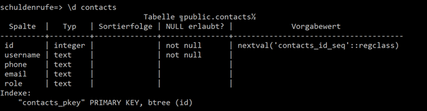
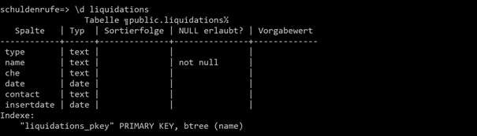
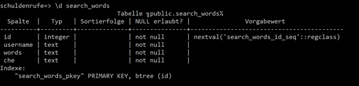
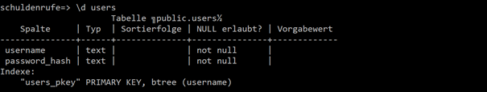
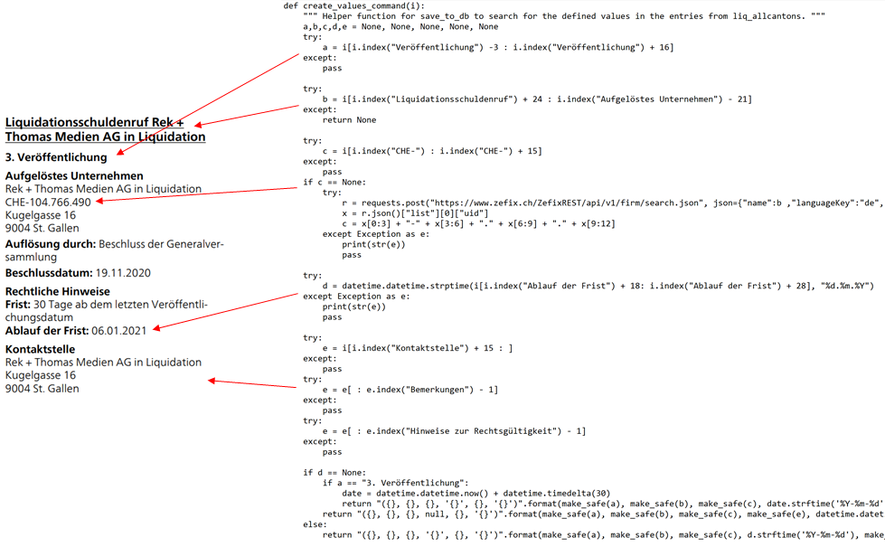
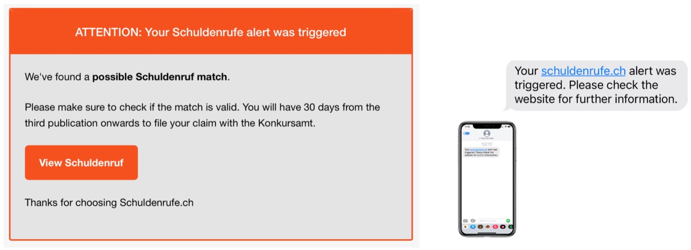
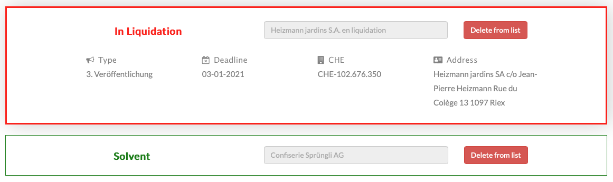

# *Schuldenrufe.ch* - Group Assignment 6 (DSCS 2020)
*by Dominik Buchegger* ([dominik.buchegger@student.unisg.ch](mailto:dominik.buchegger@student.unisg.ch))\
*by Leonard Konstantin Kehl* ([leonard.kehl@student.unisg.ch](mailto:leonard.kehl@student.unisg.ch))

## About
*Schuldenrufe.ch* is an early-stage startup located in the swiss service sector industry. It helps companies and private investors to keep track of a
possible default of their stakeholders in a user-friendly way, which is completely new to the industry. Looking into the practice of today’s default
monitoring makes clear, where the pain points are and what the real added value of *Schuldenrufe.ch* is.

If a company in Switzerland goes bankrupt or decides to cease its business activities, a liquidation of all assets is performed. To inform
respective creditors and give them sufficient time to file their claims, a company is required to make three publications in the Schweizerisches
Handelsamtsblatt [SHAB](https://www.shab.ch). A creditor is entitled to file his claims in a 30-day period, starting with the third publication.
Since a few years the SHAB is completely digital and it is possible to search each company on their website. Because frequently consulting the
register manually is very inconvenient and time consuming, today this task is either skipped or outsourced to law firms, charging a lot of money.
This is where *Schuldenrufe.ch* comes into place by providing an inexpensive and easy to use solution to monitor an unlimited list of companies.
Using our service our clients are able to search if companies are in liquidation and save them to a private monitoring list. Leaving contact
information, a creditor is automatically notified via email and/or SMS when a default on his list is detected, right after the newest SHAB is
published early in the morning, even before the workday starts. 

By providing a reliable, easy to use and affordable service, whilst not having to make any compromises, our unmatched service can be seen as a
substitution for existing services and at the same time encourage and empower today’s non-users to start implementing an active defaulter management.
Solving the described information asymmetry between defaulter and creditor is important for every company, since business with a defaulting company
has to be stopped immediately to avoid further judicial litigation and to gain time for preparing the filing which can require extensive preparation.
We therefore strongly believe that *Schuldenrufe.ch* is not only attractive to customers already monitoring their portfolio of stakeholders, but also
to today’s non-users. Regarding the progressive number of bankruptcies, given the recent COVID-19 crisis, defaulter management is more relevant than ever. 

# Launch instructions 
Understanding this code needs some experience with programming and python. Therefore it is also a requirement to be able to navigate the Google Cloud
Platform and to have a basic understanding of PSQL, SSH & SCP as these steps won't be explained in detail. If you have this knowledge, you can follow
the further instructions to be able to launch this project by yourself.

**Step 0: Set Up**
 - Create a new Compute Engine Instance in GCP with ubuntu 20.10 and a static ip.
 - Create a PSQL Instance in GCP and add a database. Tick the public ip field in the connection tab and add your own ip, the static server ip and the
 Data Studio ips 64.18.0.0/20, 64.233.160.0/19, 66.102.0.0/20, 66.249.80.0/20, 72.14.192.0/18, 74.125.0.0/16, 108.177.8.0/21, 173.194.0.0/16,
 207.126.144.0/20, 209.85.128.0/17, 216.58.192.0/19, 216.239.32.0/19).

**Step 1: Configure the PSQL database**
Add following tables:

 - **contacts**
 
 

 - **liquidations**
 
 

 - **search_words** (hint: use the pseudo-type serial (`ID SERIAL PRIMARY KEY`)
 
 

 - **users**
 
 
 
 Then add a default user to users (_no security risk - there is no sensitive data & nobody can use this password, because it's not a hash)_:  `INSERT INTO users VALUES('default', 'default');` 

**Step 2: Configure the GCP VM**

 - **SSH into the server** (easiest way: use the google cloud shell on the website)    
	- install a text editor e.g.` sudo apt-get install nano `
	
	
 - **Setup the firewall** (otherwise you might have issues later on when SSHing into the server) 
	- update existing list of packages ` sudo apt-get update && sudo apt update `
	- install ufw to handle firewalls ` sudo apt install ufw `	
	- check the available ufw apps ` sudo ufw app list `  	
	- allow OpenSSH ` sudo ufw allow OpenSSH `  	
	- make the firewall active ` sudo ufw enable `  
	- check if OpenSSH is allowed ` sudo ufw status `
	
 - **Install Docker** (used to create containers (like virtual machines on the same compute engine instance)) 
	- install packages so apt an use packages over HTTPS ` sudo apt install apt-transport-https ca-certificates curl software-properties-common ` 	
	- add the GPG key for the official Docker repository ` curl -fsSL https://download.docker.com/linux/ubuntu/gpg | sudo apt-key add - ` 	
	- add the Docker repository to apt ` sudo add-apt-repository "deb [arch=amd64] https://download.docker.com/linux/ubuntu bionic stable" `	
	- update packages with the Docker packages from the added repository ` sudo apt update `	
	- make sure to install from the Docker repository ` apt-cache policy docker-ce ` output should be Installed: (None)	
	- install Docker ` sudo apt install docker-ce `	
	- add the current username to the docker group ` sudo usermod -aG docker ${USER} `	
	- exit the server ` exit `
	- open the SSH console again and check if Docker is in the list after your username ` id -nG `

- **Edit the Code from docker1 & docker2:**	
	- Add your own credentials to the used services in the passwordfile in both folders.	
	- In docker1/templates replace the data studio link in index.html (line 329).

- **Setup the Docker Containers:**
- Docker Container 1:
	- pull the latest ubuntu image for docker ` docker pull ubuntu `
	- build this image ` docker run -it ubuntu ` you can now type code in the docker and should see root@......
	- update existing list of packages ` apt-get update && apt update `  
	- install python ` apt install software-properties-common ` ` add-apt-repository ppa:deadsnakes/ppa `  ` apt update `  
	- install pip ` apt install python3-pip `  
	- install editor e.g. ` apt-get install nano `  
	- install libpq-dev (necessary for a python library) ` apt-get install libpq-dev `  
	- install cron (to run python programs at defined time) ` apt-get install cron `  
	- exit the docker container ` exit `
	- check all docker container ` docker ps -a ` the newly created docker will be disabled
	- start the created docker container ` docker start <dockername> `
	
	- upload docker1 to the server, cd in this directory and copy it to the Docker container ` (sudo) docker cp docker1 <dockername>:docker1 `
	- start the interactive shell to reconnect with the docker container ` docker exec -it <dockername> /bin/bash ` 
	- check if the folder was uploaded correctly ` dir `
	- install the requirements for the python programs ` pip3 install -r docker1/requirements1.txt `  
	- start cron (scheduler service) and check if it's running ` service cron start `  ` service cron status `  
	- edit the crontab to specify when your programs should run and where the output should be saved ` crontab -e `  
		50 5 * * 1-5 cd /docker1 && python3 main.py >> /var/log/main.log 2>&1  
		59 5 * * 1-5 cd /docker1 && python3 messaging.py >> /var/log/message.log 2>&1*  
		_exit with ctrl+x, press Y & press enter_
	- check your newly created crontab ` crontab -l `  
	
	- You can now exit the server (`exit `). After the execution time you can check the defined log file to see if it worked. More possible values for crontab you can find on www.crontab.guru!
	

- Docker Container 2 (faster setup, because we let docker-compose do all this work - we still think it's useful to do it once manually, for you to have a bigger learning and understand Docker properly):
	- install docker-compose and define rights ` sudo curl -L https://github.com/docker/compose/releases/download/1.18.0/docker-compose-`uname -s`-`uname -m` -o /usr/local/bin/docker-compose ` ` sudo chmod +x /usr/local/bin/docker-compose `  
	- upload docker2 to the server and cd into it with ` cd docker2 `
	- build docker2 with docker-compose ` docker-compose up –build `  
	- when it's done building and you see flask output, hit _ctrl+c_
	- check the name of the newly created docker container ` docker ps -a ` 
	- start the newly created docker container & check if it's running ` docker start <dockername> ` ` docker ps -a `  
	
	- You can now exit the server (` exit `).
	

- _Some useful Docker commands:_
	- Show all docker containers ` docker ps -a `
	- Start/Stop/Delete a docker container ` docker start/stop/rm <dockername> `
	- Connect again to a docker container ` docker exec -it <dockername> /bin/bash `
	- Copy something from host to a docker container ` docker cp <filename> <dockername>:<filename> `
	- **If you stop the virtual machine instance you need to restart the docker containers** (` docker start <dockername> `)**. Then connect to Docker1** (` docker exec -it <dockername> /bin/bash `) **and check if Cron runs, otherwise start Cron** (` service cron status; service cron start `)**.**

# Description of technical features 
## Description of technical features - Docker 1

The file main.py in docker 1 which is periodically triggered by cron populates our database with all liquidation publications in the SHAB. To do this the actual SHAB issue is downloaded and then parsed with PyPDF2. For humans it is easy to understand the structure in a pdf, but due to the pdf type a computer can't understand the structure in a pdf.

For this reason all liquidation publications are read in and then splitted into blocks by searching the index for the word "Liquidationsschuldenruf". Because the pdf follows almost always the same structure we can then use further indexing to get the relevant information for all liquidation publications. There is a lot of exception handling involved because the data is not always completely published and if we definitely need a certain data for our database we need to gather it using other ways. E.g. if the CHE number is empty we try to query zefix to get the CHE number or if the ending time of the liquidation is not published in the SHAB we add 30 days if it was the third publication (because this is what is written in the law. The gathered data is then inserted into a PSQL database, while the liquidations which are overdue for 30 days are deleted.

The file messaging.py in docker1 is also periodically triggered by cron and notifies users via mail and sms if there's a match beween their saved entries and a newly added liquidation in the database. Because there are three publications for each liquidation, users will be messaged three times if they don't react and delete the company from their monitoring list immediatley (usually three days in a row).

## Description of technical features - Docker 2
Our website runs on a custom domain we purchased from hostpoint. To make this work we needed to reserve a static ip from GCP for our compute enginge instance and then created two entries to redirect schuldenrufe.ch and www.schuldenrufe.ch to our static ip. 
Since our cloud solution has direct customer exposure, we not only had to make sure that the technical functionality itself adds value, but we also had to pay attention to the design and user-friendliness in particular. Out of a user’s perspective the whole application consists of two parts in general. The first part consists of a Landing-, Sign In and Register page. The Landingpage is the first page the user sees and therefore mainly fulfills marketing purposes. The second part is revealed after signing in and contains the functions coming with a premium plan, called Cockpit. 

### Landingpage (.../)
As mentioned, the Landingpage is primarily focused on marketing. Here you can find our service and company description, as well as a (for now fictional) pricing scheme. On the bottom of the page there is a contact form which is implemented using Flask WTForms. Form classes can be found in the forms.py file. After submission the contact form sends an email to the responsible employee. The function for sending the email can be found in help_email.py. We are using the REST based API of the external service provider [mailgun](https://www.mailgun.com). The main feature of the Landingpage consists of the possibility to test our service of looking up a company in the default register of SHAB. This suits as a preview as it is similar to the premium function but with limited functionality. To trigger the search the form on the top of the page has to be used. As a result, a complex process is triggered. Because we didn't want to have to refresh the whole window on action, we opted for a solution which allows us to update only small sections of the user’s window. We are using JavaScript and jQuery (mainly in app.js file) to accomplish this. In order to find possible matches between the company name entered by the user and the SHAB, we had to make sure that we either force the user to enter a correct name or to implement fuzzy matching. We found a practical and especially to the user experience beneficial solution by accessing the Zentraler Firmenindex [ZEFIX](https://www.zefix.ch/de/search/entity/welcome) of Switzerland. The implementation of the used post request on their API can be seen in the main flaskapp.py. It is implemented using a, for the user inaccessible route, called /newindexsearch. The response is a json containing none to multiple names of matching company names in order of the likeliness that the user really meant the respective company. The script is now looking for matches in our database containing the liquidations scraped from SHAB every workday morning when Docker1 checks for new liquidations. In addition, other company names, if found by ZEFIX, are passed. Now the page section beneath the form is reloaded and shows the result of our most likely match as well as up to three other company names as a "did you mean instead?" functionality. In regard to the result the content shown differs slightly if it is a match or not. The content for the refreshed section can be found in the file section3.html. Using the Flask Login Manager, the navbar is altered depending on the sign in status of the user. If the user is not logged in the navbar on the Landingpage gives access to the routes Sign In and Register. If he is logged in, the routes Cockpit and Logout are accessible. Since we separated our application in two sections, we are using two completely different navigation bars for the Cockpit and other the other pages. Therefore, the navbar for Cockpit can be found in the base.html which is parent to all its belonging sites and the navbar for Landingpage can be found under landingpage.html itself. Additionally, as mentioned before, the navbar discriminates for the sign in status. On top we embedded a Google Data Studio which is linked to our databases. Here we get live information about our user count and other kpi's. At the same time we are displaying the historical movement of default figures. 

Additionally we want to point out that our frontend is based on an html template by [w3schools](https://www.w3schools.com/css/css_rwd_templates.asp). Some elements are dynamically designed using a library for ready-to-use browser animations by [Daniel Eden](https://daneden.github.io/animate.css/). Vector graphs are retrieved from [Freepik](https://www.freepik.com).

### Sign In (/login) and Register (/register)
Both Sign In and Register page are using Flask WTForms. Classes can be found in forms.py. For both functionalities a separate table of our database (users) is used to either insert or validate credentials. The password is hashed using the Bcrypt library. Functions can be found in the main flaskapp.py file under "Helper Functions". By logging in the Cockpit is entered.  

### Search & Save (/query)
The Search & Save page forms, together with the Manage Contacts page, the second part of the cloud solution. The functionality of this page is in its base very similar to the previously descripted search function on the Landingpage. Since both even have the majority of the code in common the base functionality won't be explained again in this chapter. Please have a look at the Landingpage Chapter for further information. In addition to the search functionality on the Landingpage, the Search & Save page offers the functionality of saving the results of the search to a list on the bottom of the page. The list is stored in a separate database table and serves as information source for the daily monitoring (functionality explained in another chapter in detail). The implementation of putting companies on the list and deleting companies from it can be found in the flaskapp.py file under "Inaccessible Helper Routes". This functionality is also activated on the Landingpage for logged in users. A table of all entries in this list is displayed at the bottom of the page. When deleting entries again only the section gets refreshed using JavaScript and jQuery. Companies in liquidation are displayed in a red frame. With them there is displayed further information about the company and information regarding the liquidation. 

### Manage Contacts (/contact)
To fulfill the service of monitoring defaults we need to gather contact information. The user can edit information on the Manage Contacts page. Here a simple Flask WTForm is used to add a contact. For sectional updating when deleting or editing an entry, once again JavaScript and jQuery are used. There is another database table for storing the contacts. The implementation of the altering of the contacts can be found in main.py under "Helper Functions for accessible Routes". To edit a contact, alter the displayed information and save the change by clicking the button. 

# Challenges and their solution 
Retrospective we are have to admit that we are very proud about how our final product turned out but the making was characterized by trial and much more error. Here comes a list of our major challanges and our solutions/ learnings we have made in the process: 

* Challenge 1 - Coding together: The first issue we encountered is linked to the fact that we sometimes wanted to work with the same files at the same time. Without having to much knowledge about GitHub we realized that GitHub Desktop made it really easy for us to collaborate because it did everything for us and we only had to press the push/pull button.
* Challenge 2 - Big pdf (no structure on machine level): Because a pdf does not have a structure like an HTML or an XML we needed to figure a way out to parse it anyways. We found a library (PyPDF2) which did a pretty good job parsing the pdf. But then we had this large string of text and needed to gather our data in it. Luckily the file has almost always the same structure and only some missing values. Therefore with some exception handling we managed to use string indexing to split the data and gather the relevant entries. So we thought everything was working and then the next day came and we realized there was a little difference in the pdf (a certain title was missing, which we used to determine where the data we were interested in ended) and our whole program didn't work anymore. We also fixed this and managed to make it work for the pdfs of the past ~5 weeks but there is no guarantee there can't be another rare change in the future we couldn't anticipate and then we would have to fix this again.
* Challenge 3 - We wanted to implement some sort of fuzzy matching: We did this in PSQL and it worked, but then we wanted to alert our users by sms or email when there is a match in their saved entries and our liquidations table. So we tried to figure out how high we should set the threshold, but this was unsatisfying. We then tried to use zefix.ch (there you can enter some characters and they return all companies with their CHE number) for our fuzzymatching and used a GET HTTP request on this url. After thinking we solved the fuzzy matching issue we realized Zefix was giving us an empty answer back. Through detailed inspection we found out that Zefix itself makes a POST request to an internal API which returns all values we were interested in and then used that same POST request for our search in zefix.
* Challenge 4 - Updating table without reloading the whole page: After watching some YouTube videos we found a way to do this with Jquery and Javascript. That seemed pretty easy in the video, until we wanted to make a small change to the Javascript code and realized we didn't understand a single thing in this code. We then started to read some basics for Javascript until we had a clue what the code was doing and where able to modify it to our needs and implement this partial reload.
* Challenge 5 - We have three apps (one should run always and the other two only once per week day). Instead of creating two servers we wanted to do this on one server with Docker. Again it seemed pretty easy in the beginning but then we ran into several issues and didn't understand what the docker-compose code was acutally doing. We then started with the basics and read/watched some tutorials. We then installed Docker by ourselves and did the whole container creation manually. After doing this we finally understood how docker-compose should work (which does everything for you) and managed to implement our second docker through docker-compose. We also did this for the first docker, which we had built manually. After making this work we realized, that doing everything manually was such a huge learning for us and enabled us in the first place to do the same with docker-compose. We then decided there's no big benefit to implement both containers with docker-compose, but a huge learning when doing it manually and that's why one of our docker containers is created manually while the other is created automatically.
* Challenge 6: The two apps that run each weekday should start automaticall each day and we didn't want to run them with time.sleep(24h). For this reason we installed cron in our docker container and created crontabs to start each program automatically at the defined time. It took us a long time to figure out that we need to start the cron service in the docker container. Before it (obviously) never executed and we didn't know what the issue was. Also in the beginning we had some unstructured folder structure and Cron didn't know in which folder our program was. Because Cron by default has no error log we didn't understand why it did not work but after watching some YouTube tutorials and reading stackoverflow posts we managed to implement a log that is written if the program is executed or if there's an error and could then quickly root out the error in the code.
* Challenge 7: The SHAB gets published every workday and there is no aggregated list of recent liquidations available. But in order to validate if a company is in liquidation up on a search request, we need to have liquidation entries from a much longer period going into the past. As a solution we started populating our database with the SHAB publications of the last 30 days. Unfortunately we figured out, that some companies in liquidation are still entered in ZEFIX, even if they are in liquidation for a longer period of time. Since the liquidation status can be easily validated by the companies name, but it is hard to detect by code, due to the changing characteristics of this marking, we left it that way for now. As our database is filling up by beeing populated every work day, this issue is resolving itself in the near future. 
